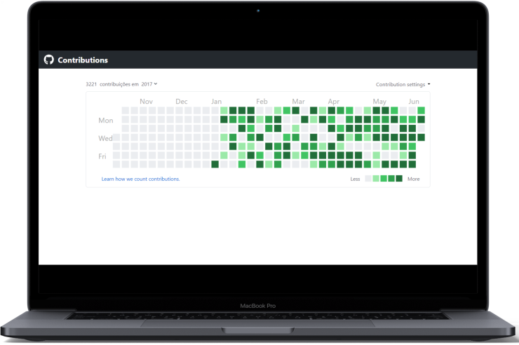
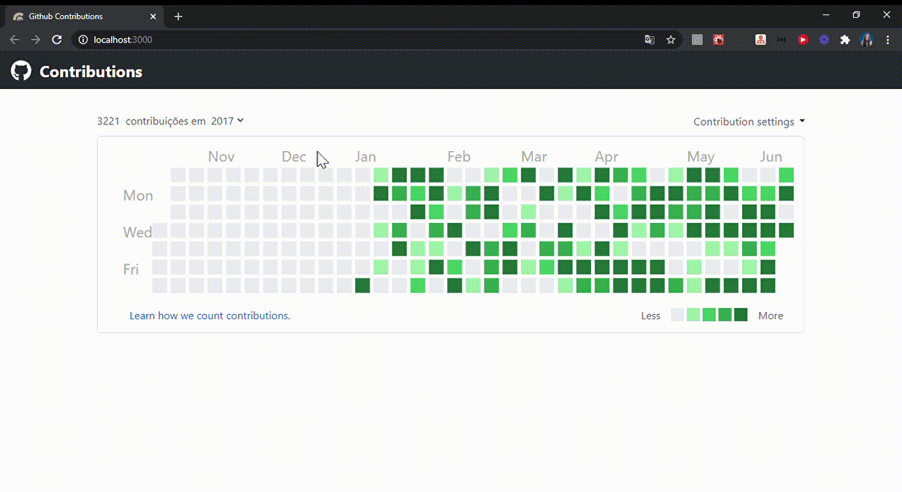
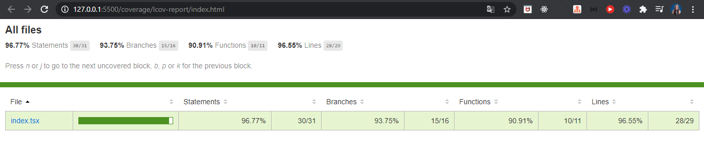

<p align="center">
  
  
</p>

<h1 align="center">
  Quadro de contribuições do Github
</h1>

<h3 align="center">
  O objetivo foi o desenvolvimento do front-end de uma réplica do quadro de contribuições do Github sem utilização de bibliotecas e os dados a serem consumidos são de um arquivo JSON fornecido.
</h3>

<p align="center">
  

  

  
</p>

<p align="center">
  <a href="#funcionalidades">Funcionalidades</a>&nbsp;&nbsp;&nbsp;|&nbsp;&nbsp;&nbsp;
  <a href="#heavy_check_mark-configurações-necessárias">Configurações necessárias</a>&nbsp;&nbsp;&nbsp;|&nbsp;&nbsp;&nbsp;
  <a href="#arrow_down_small-clonando-o-repositório">Clonando o repositório</a>&nbsp;&nbsp;&nbsp;|&nbsp;&nbsp;&nbsp;
  <a href="#beginner-iniciando-a-aplicação">Iniciando a aplicação</a>&nbsp;&nbsp;&nbsp;|&nbsp;&nbsp;&nbsp;
  <a href="#mag-realizando-os-testes">Realizando os testes</a>&nbsp;&nbsp;&nbsp;|&nbsp;&nbsp;&nbsp;
  <a href="#wrench-tecnologias--ferramentas--recursos">Tecnologias | Ferramentas | Recursos</a>&nbsp;&nbsp;&nbsp;|&nbsp;&nbsp;&nbsp;
  <a href="#memo-license">Licença</a>
</p>

### Funcionalidades mapeadas

- Seleção de anos conforme dados do arquivo JSON; :heavy_check_mark:
- Atualização da quantidade de contribuições conforme ano selecionado; :heavy_check_mark:
- Atualização do retorno visual do quadro de contribuições conforme ano selecionado; :x:
- Link para página do Github que explica a contagem de contribuições; :heavy_check_mark:
- Réplica do quadro de contribuições do Github; :x:
- Testes relacionados à página criada. :heavy_check_mark:
### :heavy_check_mark: Configurações necessárias

Seguem as configurações neessárias para visualizar a aplicação em sua máquina.

-  [Git](https://git-scm.com);
-  [Node](https://nodejs.org/);
-  [Yarn](https://yarnpkg.com/).

### :arrow_down_small: Clonando o repositório
1. Pelo terminal, acesse o diretório em que deseja ter o repositório clonado e execute o comando a seguir.
```bash
# clonando o repositório
git clone https://github.com/belapferreira/github-contributions
```

### :beginner: Iniciando a aplicação
1. Pelo terminal, acesse a pasta do repositório clonado e execute os comandos abaixo.
```bash
# instalando as dependências
yarn install

# iniciando a aplicação
yarn start
```
### :mag: Realizando os testes
1. Foram criados testes para verificar a renderização do HTML da aplicação e também para o elemento que permite a seleção do ano para qual haverá o retorno visual em tela. Para ativar os testes execute o comando abaixo estando na pasta do projeto;
```bash
# ativando testes
yarn test
```

2. Para gerar o Coverage Report execute o comando abaixo no terminal e será criada uma pasta chamada `coverage` na raiz do projeto. Dentro dessa pasta haverá outra chamada `Icov-report` que conterá um arquivo `index.html`. Ao abrir `index.html` será possível visualizar o relatório de cobertura dos testes da página da aplicação.
```bash
# gerando Coverage Report
yarn test --coverage --watchAll false
```
<p align="center">
  
</p>

### :wrench: Tecnologias | Ferramentas | Recursos

Esse projeto foi desenvolvido utilizando os seguintes recursos:

-  [Date FNS](https://github.com/date-fns/date-fns);
-  [Editor Config](https://editorconfig.org/);
-  [Eslint](https://eslint.org/);
-  [Jest](https://jestjs.io/);
-  [Prettier](https://prettier.io/);
-  [React](https://pt-br.reactjs.org/);
-  [React Calendar Heatmap](https://github.com/kevinsqi/react-calendar-heatmap);
-  [React DOM](https://pt-br.reactjs.org/docs/react-dom.html);
-  [React Icons](https://react-icons.github.io/react-icons/);
-  [React Router Dom](https://reactrouter.com/web/guides/quick-start);
-  [React Scripts](https://github.com/facebook/create-react-app/tree/master/packages/react-scripts);
-  [React Test Renderer](https://github.com/facebook/react/tree/master/packages/react-test-renderer);
-  [Styled Components](https://styled-components.com/);
-  [TypeScript](https://www.typescriptlang.org/).


### :memo: License
Esse projeto está sob MIT license. Veja [LICENSE](https://github.com/belapferreira/github-contributions/blob/master/LICENSE) para mais informações.

---

Feito por Bela Ferreira :blue_heart: Contato: https://www.linkedin.com/in/belapferreira :blush:
